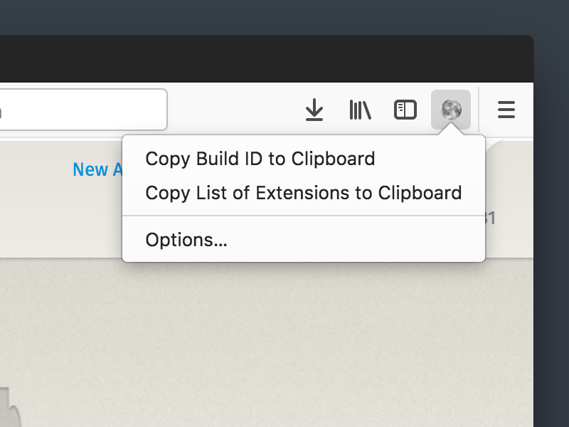

# Nightly Tester Tools

Nightly Tester Tools (NTT) is an add-on for aiding testers of Nightly builds of Mozilla apps including Firefox.



## Features

* Copy the build ID or list of extensions to the clipboard using the toolbar button
* Insert the build ID or list of extensions into a textbox using the context menu
* Option to customize the Title Bar

## Limitations

There are a couple of known issues due to the limited [WebExtensions APIs](https://developer.mozilla.org/Add-ons/WebExtensions/API):

* The changeset cannot be retrieved
* The extension list does not include system add-ons
* Some variables are not available for the custom title template

The following features found in the original XUL-based extension are not yet implemented, and some of them may not be implemented again:

* Copy `about:support` to Pastebin
* Open the profile folder (Use `about:support` or `about:profile` page instead to open it)
* Open the pushlog
* Screenshot utility (Use [Firefox Screenshots](https://support.mozilla.org/kb/firefox-screenshots) instead)
* Crash options
* Extension compatibility fixer
* Menu items under Tools

## Compatibility

The current WebExtension version is only compatible with Firefox. Use legacy [version 3.10](https://addons.mozilla.org/firefox/addon/nightly-tester-tools/versions/3.10) for Thunderbird and SeaMonkey.

## Install

You can install the latest stable NTT from [addons.mozilla.org](https://addons.mozilla.org/firefox/addon/nightly-tester-tools/).

To install for development, clone the repo:

```
git clone git://github.com/mozilla/nightlytt.git
```

Install the [`web-ext` command line tool](https://developer.mozilla.org/Add-ons/WebExtensions/Getting_started_with_web-ext):

```
npm install --global web-ext
```

To test with Firefox:

```
web-ext run -s extension
```

To build for release:
```
web-ext build -s extension
```

You can also [temporarily install the extension](https://developer.mozilla.org/Add-ons/WebExtensions/Temporary_Installation_in_Firefox) in your Firefox without having to use `web-ext`.

## Development

All bugs and feature requests are filed in the Nightly Tester Tools project at GitHub. You can [view the list of open issues](https://github.com/mozilla/nightlytt/issues), or you can [file a new issue](https://github.com/mozilla/nightlytt/issues/new). Check out [the wiki](https://wiki.mozilla.org/Auto-tools/Projects/NightlyTesterTools) for a list of current and proposed features and feel free to file bugs and submit patches.

This project uses [`.editorconfig`](http://editorconfig.org/#overview), which sets defaults for the formatting of the code. So enjoy the use of [compatible editor](http://editorconfig.org/#download). Just download and install the corresponding plugin.

Also, it's encouraged to use the `web-ext lint` command to [check the code](https://developer.mozilla.org/Add-ons/WebExtensions/Getting_started_with_web-ext#Checking_for_code_lint).
